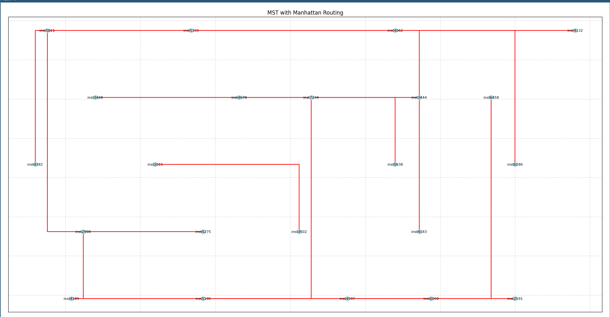

# PD-II

Implementation the Prim-Dijkstra-II algorithmn for Timing-driven Routing Trees in Python.

# Current Situation (2025-06-15)

- Parser of Def/Lef files pro ispd2018 contest working (OK)
- Graph from parsed files construction (OK)
- Construction of Minimum Spanning Tree (MST) from Graph (OK)
- Visualization of resulting MST (OK)

## TODO

- Verify if the MST algorithmn correctly builds 
- Implement PD-II algorithmn

# Bibliography

Charles J. Alpert, Wing-Kai Chow, Kwangsoo Han, Andrew B. Kahng, Zhuo Li, Derong Liu, and Sriram Venkatesh. 2018. Prim-Dijkstra Revisited: Achieving Superior Timing-driven Routing Trees. In Proceedings of the 2018 International Symposium on Physical Design (ISPD '18). Association for Computing Machinery, New York, NY, USA, 10–17. https://doi.org/10.1145/3177540.3178239
